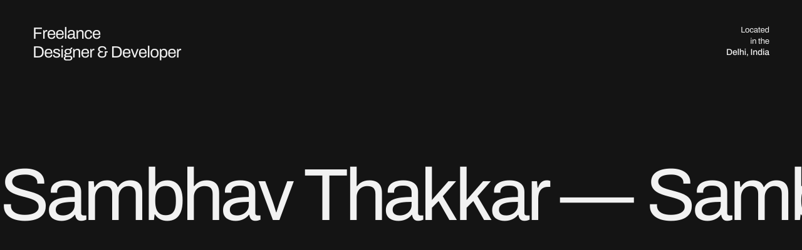
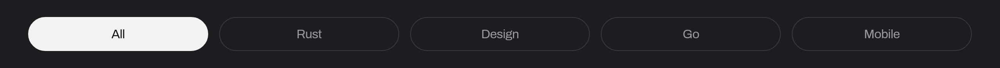
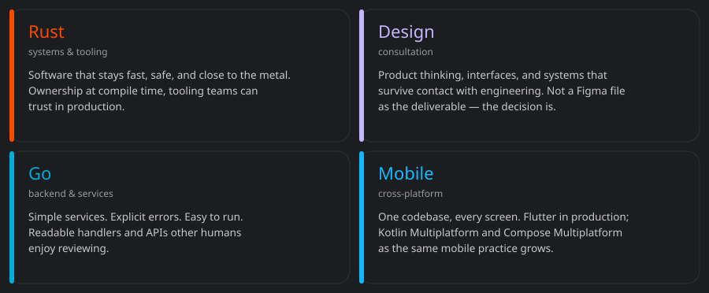
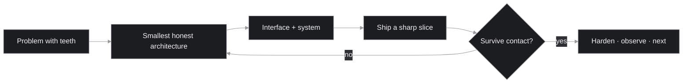
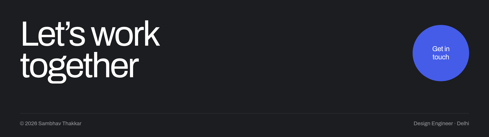

<!--
  GitHub profile README for sambhavthakkar/sambhavthakkar
  Palette: #141414 black · #F2F2F2 paper · #999A9E muted · #2E2F32 line
-->

<p>
  
</p>

© Code by Sambhav
&nbsp;·&nbsp;
[Work](https://github.com/sambhavthakkar?tab=repositories)
&nbsp;·&nbsp;
[GitHub](https://github.com/sambhavthakkar)
&nbsp;·&nbsp;
[LinkedIn](https://linkedin.com/in/sambhavthakkar)
&nbsp;·&nbsp;
[X](https://x.com/sambhavthakkar)
&nbsp;·&nbsp;
[Email](mailto:thakkarsambhav@gmail.com)

---

Helping products stand out in the digital era. I **design** the interface and **ship** the system behind it. No handoff — one practice, on the cutting edge.

Design, code, and interaction sit in the same hand. The dock is a filter on this profile — Rust, design, Go, or mobile — not a different website.

```ts
// studio.ts
export const sambhav = {
  role: "Software Engineer",
  practice: "interface + system, same hand",
  lenses: ["rust", "design", "go", "mobile"],
  stack: ["kmp", "flutter", "react", "next", "go"],
  base: "Delhi",
  loop: "explore → ship → refine",
} as const;
```

---

<sub>SIGNAL</sub>

<div align="center">
  
  <br />
  
  
  <br />
  
</div>

Updated 2026-09-23 01:33 UTC <!--STATS_UPDATED-->

Most of that lives in private repos and client work. The public graph is not the map.

---

<sub>PRACTICE FILTERS</sub>

<p>
  
</p>

The dock is a filter. One profile. Four lenses.

<p>
  
</p>

---

<sub>HOW I THINK ABOUT A BUILD</sub>



Interface and system, same hand. The slice that survives a real user is the one that stays.

---

<sub>TOOLKIT</sub>

languages & runtimes · Kotlin · Dart · Go · TypeScript · JavaScript · Python

product surface · Flutter · React / Next.js · Firebase · Figma

ops & systems · Linux · Docker · Git · GitHub · Cloudflare

<sub>KMP · Compose Multiplatform · Flutter · React / Next.js · Go · UI/UX · Rust exploring</sub>

---

<sub>OPERATING NOTES</sub>

- Prefer a boring, correct protocol over a clever one that flakes.
- No handoff. The interface and the system are the same job.
- Agents are interesting. Orchestration is the actual product.
- Ship the slice that survives contact with a real user.
- Layout is a feature when resources get tight.
- Delhi nights. Quiet commits. Systems that compound.

---

<p>
  <a href="mailto:thakkarsambhav@gmail.com">
    
  </a>
</p>

[thakkarsambhav@gmail.com](mailto:thakkarsambhav@gmail.com)
&nbsp;·&nbsp;
[github.com/sambhavthakkar](https://github.com/sambhavthakkar)
&nbsp;·&nbsp;
[linkedin.com/in/sambhavthakkar](https://linkedin.com/in/sambhavthakkar)
&nbsp;·&nbsp;
[x.com/sambhavthakkar](https://x.com/sambhavthakkar)
