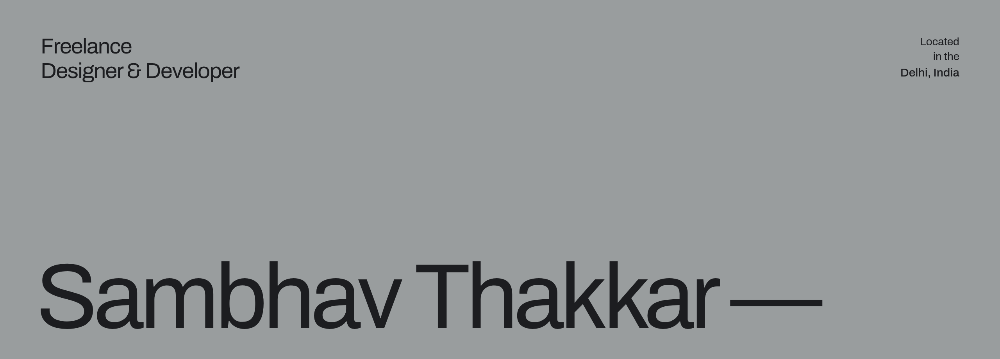
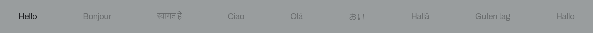
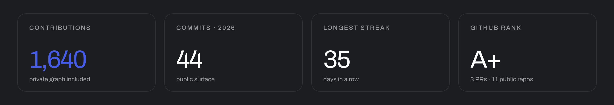
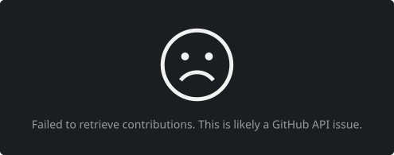
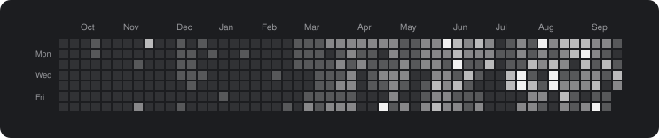
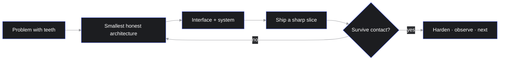

<!--
  GitHub profile README for sambhavthakkar/sambhavthakkar
  Palette: #1C1D20 charcoal · #999D9E hero · #455CE9 accent · #999A9E muted
-->

<p>
  
</p>

<p>
  
</p>

© Code by Sambhav
&nbsp;·&nbsp;
[Work](https://github.com/sambhavthakkar?tab=repositories)
&nbsp;·&nbsp;
[GitHub](https://github.com/sambhavthakkar)
&nbsp;·&nbsp;
[LinkedIn](https://linkedin.com/in/sambhavthakkar)
&nbsp;·&nbsp;
[X](https://x.com/sambhavthakkar)
&nbsp;·&nbsp;
[Email](mailto:thakkarsambhav@gmail.com)

---

Helping products stand out in the digital era. I **design** the interface and **ship** the system behind it. No handoff — one practice, on the cutting edge.

Design, code, and interaction sit in the same hand. The dock is a filter on this profile — Rust, design, Go, or mobile — not a different website.

```ts
// studio.ts
export const sambhav = {
  role: "Design Engineer",
  practice: "interface + system, same hand",
  lenses: ["rust", "design", "go", "mobile"],
  stack: ["kmp", "flutter", "react", "next", "go"],
  base: "Delhi",
  loop: "explore → ship → refine",
} as const;
```

---

<sub>SIGNAL</sub>

<p>
  
</p>

<p>
  
  
</p>

<p>
  
</p>

Most of that lives in private repos and client work. The public graph is not the map.

---

<sub>PRACTICE FILTERS</sub>

<p>
  
</p>

The dock is a filter. One profile. Four lenses.

<table>
  <tr>
    <td width="50%" valign="top">
      <h3>Rust</h3>
      <p><sub>systems &amp; tooling</sub></p>
      <p>Software that stays fast, safe, and close to the metal. Ownership at compile time, tooling teams can trust in production.</p>
    </td>
    <td width="50%" valign="top">
      <h3>Design</h3>
      <p><sub>consultation</sub></p>
      <p>Product thinking, interfaces, and systems that survive contact with engineering. Not a Figma file as the deliverable — the decision is.</p>
    </td>
  </tr>
  <tr>
    <td width="50%" valign="top">
      <h3>Go</h3>
      <p><sub>backend &amp; services</sub></p>
      <p>Simple services. Explicit errors. Easy to run. Readable handlers and APIs other humans enjoy reviewing.</p>
    </td>
    <td width="50%" valign="top">
      <h3>Mobile</h3>
      <p><sub>cross-platform</sub></p>
      <p>One codebase, every screen. Flutter in production; Kotlin Multiplatform and Compose Multiplatform as the same mobile practice grows.</p>
    </td>
  </tr>
</table>

---

<sub>CURRENTLY IN MOTION</sub>

<table>
  <tr>
    <td width="33%" valign="top">
      <h3>product surfaces</h3>
      <p>Cross-platform apps and web with a real design system — KMP / Compose Multiplatform, Flutter when it fits, React / Next.js, the last 10% that makes it feel finished.</p>
    </td>
    <td width="33%" valign="top">
      <h3>full-stack slices</h3>
      <p>Client to service. Go backends, API contracts, and the glue that keeps mobile and web telling the same story. Full Stack intern @ FabroLabs.</p>
    </td>
    <td width="33%" valign="top">
      <h3>systems that stay up</h3>
      <p>Local-first setups, self-hosted automation, backends that survive a bad network and a worse meeting.</p>
    </td>
  </tr>
</table>

---

<sub>RECENT WORK</sub>

<table>
  <tr>
    <td>
      <h3><a href="https://github.com/sambhavthakkar">Portfolio Website</a></h3>
    </td>
    <td align="right">
      Design &amp; Development<br />
      <sub>2026</sub>
    </td>
  </tr>
  <tr>
    <td>
      <h3><a href="https://github.com/sambhavthakkar/SuperShop">SuperShop</a></h3>
    </td>
    <td align="right">
      Flutter · product<br />
      <sub>public</sub>
    </td>
  </tr>
  <tr>
    <td>
      <h3><a href="https://github.com/sambhavthakkar/QuantaraX">QuantaraX</a></h3>
    </td>
    <td align="right">
      Go · systems<br />
      <sub>public</sub>
    </td>
  </tr>
  <tr>
    <td>
      <h3><a href="https://github.com/sambhavthakkar/PulseDrive">PulseDrive</a></h3>
    </td>
    <td align="right">
      Python · tooling<br />
      <sub>public</sub>
    </td>
  </tr>
</table>

---

<sub>HOW I THINK ABOUT A BUILD</sub>



Interface and system, same hand. The slice that survives a real user is the one that stays.

---

<sub>TOOLKIT</sub>

**languages & runtimes**


**product surface**


**ops & systems**


<sub>KMP · Compose Multiplatform · Flutter · React / Next.js · Go · UI/UX · Rust exploring</sub>

---

<sub>OPERATING NOTES</sub>

- Prefer a boring, correct protocol over a clever one that flakes.
- No handoff. The interface and the system are the same job.
- Agents are interesting. Orchestration is the actual product.
- Ship the slice that survives contact with a real user.
- Layout is a feature when resources get tight.
- Delhi nights. Quiet commits. Systems that compound.

---

<p>
  <a href="mailto:thakkarsambhav@gmail.com">
    
  </a>
</p>

[thakkarsambhav@gmail.com](mailto:thakkarsambhav@gmail.com)
&nbsp;·&nbsp;
[github.com/sambhavthakkar](https://github.com/sambhavthakkar)
&nbsp;·&nbsp;
[linkedin.com/in/sambhavthakkar](https://linkedin.com/in/sambhavthakkar)
&nbsp;·&nbsp;
[x.com/sambhavthakkar](https://x.com/sambhavthakkar)
